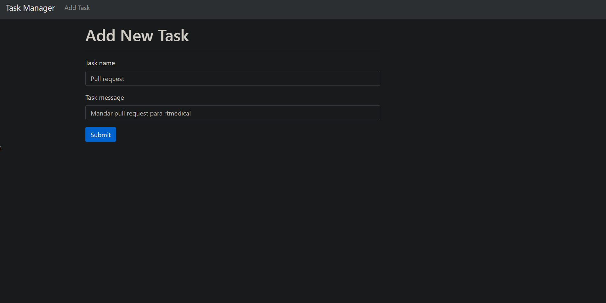
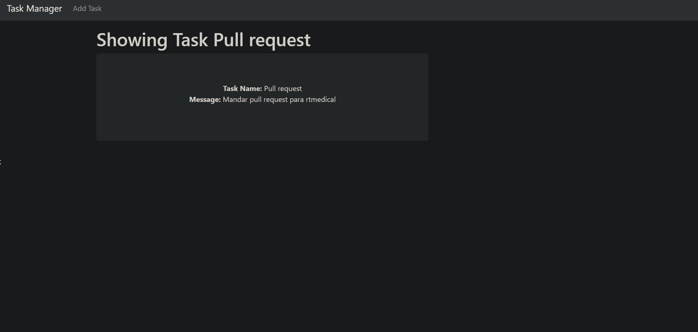
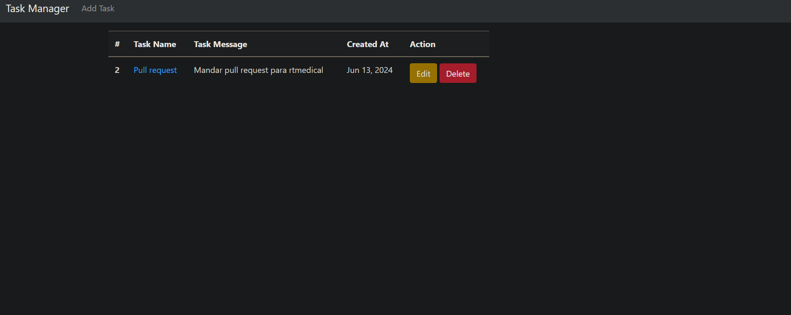
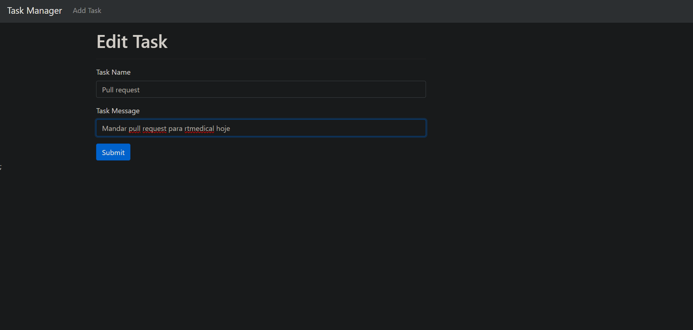
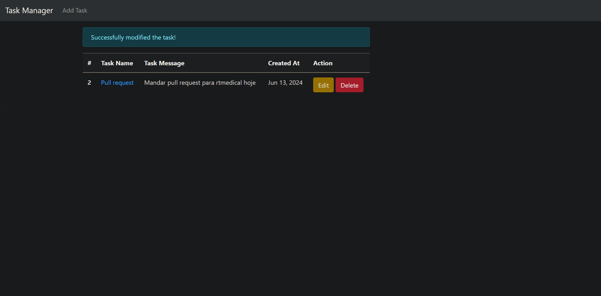
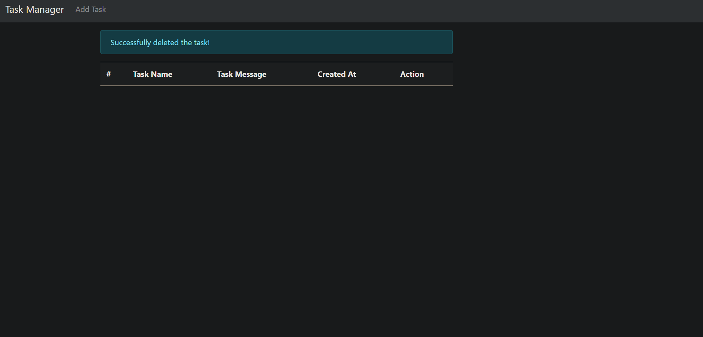

# Desafio de Programação para Estágio

Configuração e criação de um CRUD em laravel para se comunicar com um banco de dados SQL.

## Features 
### 1. Criação de tarefas

### 2. Vizualização da tarefa

### 3. Listagem de tarefas

### 4. Edição de tarefas

### 5. Exclusão de tarefas

